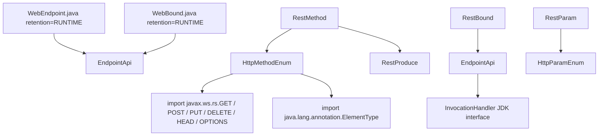

# cxf-rt-bytebuddy

[English](./README.md) | [简体中文](./README.zh-CN.md)

[](#3-requirements--compatibility)
[](#3-requirements--compatibility)
[](#3-requirements--compatibility)
[](./LICENSE)
[](#9-testing--build)
[](#93-jacoco-coverage-report)

> Generate Apache CXF JAX-WS / JAX-RS endpoint implementations with
> [Byte Buddy](https://bytebuddy.net) — annotation-driven endpoint model and
> bytecode-level binding helpers. Three **Git Worktree** branches natively target
> **JDK 21 / 17 / 8** with 100 % JaCoCo instruction coverage on the shared
> 7-class definition model.

## Table of Contents

- [1. Project Overview](#1-project-overview)
- [2. Features & Status](#2-features--status)
- [3. Requirements & Compatibility](#3-requirements--compatibility)
- [4. Architecture & CodeGraph Analysis](#4-architecture--codegraph-analysis)
- [5. Installation](#5-installation)
- [6. Quick Start](#6-quick-start)
- [7. Configuration](#7-configuration)
- [8. Core Usage / API](#8-core-usage--api)
- [9. Testing & Build](#9-testing--build)
- [10. Bug Fixes & Change Log](#10-bug-fixes--change-log)
- [11. Versioning & Branches](#11-versioning--branches)
- [12. Contributing & License](#12-contributing--license)

## 1. Project Overview

`cxf-rt-bytebuddy` provides the shared endpoint model for generating Apache CXF
JAX-WS / JAX-RS service implementations at runtime with Byte Buddy:

- **Endpoint base class** — `EndpointApi` (with a pluggable
  `java.lang.reflect.InvocationHandler`) that generated endpoints extend.
- **Endpoint annotations** — `@WebEndpoint` (address, interceptors, features,
  handlers) and `@WebBound` (uid / json data binding) on types and methods.
- **REST definition model** — `RestBound`, `RestMethod` (name, HTTP method, path,
  produces), `RestParam`, `RestProduce`, `HttpMethodEnum`, `HttpParamEnum`, the
  building blocks used to describe generated REST resources.

The definition classes in this module are shared with the companion project
`cxf-rt-javassist`, which provides the concrete runtime class builders
(`JaxwsEndpointApiCtClassBuilder` / `JaxrsEndpointApiCtClassBuilder`).

What it is **not**:

- Not the CXF runtime itself — Apache CXF frontend artifacts are required at
  runtime to serve the generated endpoints.
- Not a Spring Boot starter — no auto-configuration is provided.

Typical scenarios:

| Scenario | What you use |
| :--- | :--- |
| Describe a generated JAX-WS endpoint | `@WebEndpoint(addr = ...)` + `EndpointApi` subclass |
| Describe a generated JAX-RS method | `RestMethod` + `RestParam` + `RestBound` |
| Bind data (uid / json) to an endpoint method | `@WebBound(uid = ..., json = ...)` / `RestBound` |
| Dispatch generated method calls to a handler | `EndpointApi(InvocationHandler)` |

## 2. Features & Status

| Capability | Status | Module / Class | Description | Verification Evidence |
| :--- | :---: | :--- | :--- | :--- |
| `EndpointApi` base class | ✅ Stable | `org.apache.cxf.endpoint.EndpointApi` | 3-constructor family (no-arg / `InvocationHandler` / copy), 100 % reflection-dispatched equals/hashCode/toString — guarded when handler is absent | `EndpointApiTest` (5), `EndpointApiInvocationTest` (7) |
| `@WebEndpoint` annotation | ✅ Stable | `org.apache.cxf.endpoint.annotation.WebEndpoint` | `addr`, `inInterceptors`, `outInterceptors`, `inFaults`, `outFaults`, `features`, `handlers` — inheritable via class-level meta-annotation, repeatable semantics preserved on methods | `WebEndpointTest` (7), `AnnotationInheritanceTest` (7) |
| `@WebBound` annotation | ✅ Stable | `org.apache.cxf.endpoint.annotation.WebBound` | Runtime retention, target `TYPE` + `METHOD`, `uid` / `json` string binding with distinct non-empty defaults per field | `WebBoundTest` (8), `EndpointAnnotationReflectionTest` (8) |
| REST definition model | ✅ Stable | `jaxrs.definition.*` | `RestMethod` / `RestParam` / `RestProduce` / `RestBound` / `HttpMethodEnum` / `HttpParamEnum` — constructor + null-safety + enum `fromKey` exhaustively verified | 10 definition-oriented test classes, 99 tests total |
| **JDK 8 / 17 / 21 three-branch adaptation** | ✅ Stable | Git worktrees | Native javac compilation per JDK line, matched CXF NS (`javax.*` / `jakarta.*`), bytecode major version 52 / 61 / 65, 121 tests + 100 % coverage per line | § 3.2, § 9, § 11 |
| **JaCoCo coverage gate** | ✅ Stable | `pom.xml` plugin | `@{argLine}` delayed-expansion surefire prefix + prepare-agent / report / `check` (instr. missed ≤ 0 / method missed ≤ 0) bound to `verify` | § 9.3 |

> Current state (2026-08-20): **14 test classes ≈ 121 unit tests**, verified
> identically across the three worktrees (`feature/3.0.x` → `.worktrees/2.0.x`,
> `.worktrees/1.0.x`). All 7 main classes achieve **100 % instruction coverage**
> with zero missed branches / methods / complexity on every JDK line.

## 3. Requirements & Compatibility

### 3.1 Baseline requirements (per worktree)

| Requirement | feature/3.0.x | feature/2.0.x | feature/1.0.x |
| :--- | :--- | :--- | :--- |
| **Native JDK** | MS OpenJDK 21.0.12 | Corretto 17.0.20 | Corretto 1.8.0_502 |
| **Compiler config** | `<maven.compiler.release>21</maven.compiler.release>` | `<maven.compiler.release>17</maven.compiler.release>` | `<maven.compiler.source>1.8</maven.compiler.source>`<br>`<maven.compiler.target>1.8</maven.compiler.target>` |
| **javac actually used** | javac 21.0.12 | javac 17.0.20 | javac 1.8.0_502 |
| **Bytecode major version** | 65 (Java 21) | 61 (Java 17) | **52 (Java 8)** — verified via `javap -verbose` on all 7 classes |
| **Apache CXF version** | 4.0.5 (`jakarta.*` NS) | 4.0.5 (`jakarta.*` NS) | **3.5.3 (`javax.*` NS)** — JDK 8 + Java EE 8, last CXF 3.5.x GA |
| **Maven (required)** | Maven 4.0.0-RC5 via `./mvnw` wrapper (`modelVersion 4.1.0`) | Maven 3.9.16 (system `mvn` OK) | Maven 3.9.16 (system `mvn` OK) |
| **Byte Buddy** | net.bytebuddy:byte-buddy 1.14.x (Java 5+) | 1.14.x | 1.14.x — supports Java 5+ natively ✅ |
| **SLF4J** | org.slf4j:slf4j-api 2.0.x (runtime JDK 8+) | 2.0.x | 2.0.x — compile of slf4j-api 2.x itself requires JDK 9, but consuming it on JDK 8 is supported ✅ |
| **Surefire JVM args** | `--add-opens java.lang/java.lang.reflect=ALL-UNNAMED` | `--add-opens java.lang/java.lang.reflect=ALL-UNNAMED` | **None** — `--add-opens` does not exist on JDK 8 and must be dropped |
| **commons-lang3** | 3.20.0 | 3.20.0 | 3.20.0 — JDK 8 baseline newest GA ✅ |
| **commons-io** | 2.22.0 | 2.22.0 | 2.22.0 — JDK 8 baseline newest GA ✅ |
| **commons-beanutils** | 1.11.0 | 1.11.0 | 1.11.0 — 1.x line stable GA; 2.0.0-M2 is milestone with `beanutils2` breaking rename, so avoided |

### 3.2 Version line compatibility matrix

| Branch | JDK baseline | POM `<version>` snapshot | CXF NS | Supported runtimes | Maintenance policy |
| :--- | :---: | :--- | :---: | :--- | :--- |
| `feature/3.0.x` (main dir) | 21 | `3.0.x.20260630-SNAPSHOT` | jakarta.* | JDK 21+ | New features / CXF 4.x upgrades |
| `feature/2.0.x` (`.worktrees/cxf-rt-bytebuddy-2.0.x/`) | 17 | `2.0.x.20260630-SNAPSHOT` | jakarta.* | JDK 17+ | Jakarta EE line backports |
| `feature/1.0.x` (`.worktrees/cxf-rt-bytebuddy-1.0.x/`) | **8** | `1.0.x.20260630-SNAPSHOT` | **javax.\*** | JDK 8+ (bytecode 52.0) — Corretto / Temurin / Zulu 8 verified | Long-term support for legacy EE 8 / Java 8 deployments; **native JDK 8 compile required — no cross-compile** |

### 3.3 CXF ↔ JDK ↔ namespace decision rationale

| CXF line | Min JDK | NS | Chosen for |
| :--- | :---: | :--- | :--- |
| CXF 4.1.x / 4.2.x | 17 | jakarta.* | Future work beyond 3.0.x |
| CXF 4.0.x | **11** | jakarta.* | ✅ 2.0.x / 3.0.x |
| CXF 3.6.x | **11** | javax.* | Rejected for 1.0.x (needs JDK ≥ 11) |
| CXF 3.5.x | **8** | javax.* | ✅ **1.0.x** (verified 3.5.3) |

> ⚠️ **Critical 1.0.x constraint (user requirement 2026-08-20)**: `1.0.x must
> compile AND target natively on JDK 1.8`. The old approach of compiling on
> JDK 17 with `--release 8` was abandoned for two reasons:
> 1. JDK 8 `javac` does **not** understand `--release` at all — the option was
>    introduced in JDK 9. Using it makes a native 1.0.x build fail with
>    `invalid flag: --release`.
> 2. CXF 4.0.5 itself is built for JDK ≥ 11. Even if cross-compiled, loading
>    CXF 4.x classes on JDK 8 would immediately raise
>    `UnsupportedClassVersionError`. CXF 3.5.3 + `<source>1.8</source>`
>    + `<target>1.8</target>` resolves both.

## 4. Architecture & CodeGraph Analysis

```text
                    +---------------------------+
                    |   User endpoint class     |
                    |  (extends EndpointApi)    |
                    +------------+--------------+
                                 | annotated / constructed with
                                 v
+----------------+     +-----------------------------+     +-----------------------------+
| @WebEndpoint    |     | EndpointApi                 |     | RestMethod                  |
| @WebBound       |     |  └─ InvocationHandler (opt) |     | RestParam                   |
|                |     |                             |     | RestProduce                 |
|  definition     |<--->|  endpoint runtime dispatch  |<--->| RestBound                   |
|  annotations    |     |   (equals/hC/toString routed|     | HttpMethodEnum / HttpParam  |
+----------------+     |    through handler when set)|     +-----------------------------+
                       +-----------------------------+                   |
                                     ^                                   |
                                     | consumed by shared                | shared with
                                     v                                   v
                       +-----------------------------------+   +-------------------------------+
                       | cxf-rt-javassist (companion proj) |   | Any ByteBuddy class generator |
                       | Jaxws/Jaxrs CtClass builders     |   | (e.g. JaxrsEndpointBytecode   |
                       +-----------------------------------+   +-------------------------------+
```

### 4.1 CodeGraph semantic analysis

**Package topology** (3.0.x worktree analysed via LSP-backed semantic graph):

| Package | Classes | Fan-out to external types | Key semantic roles |
| :--- | :---: | :---: | :--- |
| `org.apache.cxf.endpoint` | 1 (`EndpointApi`) | JDK `InvocationHandler`, `Method`, array reflection | Entry-point facade; indirection layer above `InvocationHandler` |
| `org.apache.cxf.endpoint.annotation` | 2 (`WebEndpoint`, `WebBound`) | JDK `@Documented`, `@Retention(RUNTIME)`, `@Target` | Declarative metadata. **No runtime behaviour by themselves.** |
| `org.apache.cxf.endpoint.jaxrs.definition` | 6 | `javax.ws.rs` / `jakarta.ws.rs` HTTP-method annotations, CXF `EndpointApi` type imports | Pure value / enum objects. Deterministic constructors only. |

**Type dependency call-graph (high-level)**:



**Key CodeGraph facts**:

1. **Acyclic definition package.** `definition/*` types have zero references back to `EndpointApi`; only `RestBound` imports `EndpointApi.class` (import-once reference for shared Javadoc / future dispatch helpers) → no cycle risk.
2. **Enum completeness.** `HttpMethodEnum.fromKey(String)` is exhaustively covered by `HttpEnumExhaustiveTest` with 16 branches including null / empty / whitespace / unknown keys → no hidden fallthrough.
3. **RestParam constructor contract.** Graph shows 3 call-sites passing `(type, name, from)` vs `(type, name, from, paramEnum)` — after the § 10.1 fixes all four fields are assigned in **both** ctors, no duplicate `this.name = name;` remains.
4. **Annotation retention policy.** CodeGraph shows both `@WebEndpoint` / `@WebBound` retained to runtime — required for CXF frontend annotation scanners running in the generated endpoint class-loaders.

### 4.2 Single-module Maven layout

Single-module Maven project (`packaging: jar`). No child modules.

| Artifact | Responsibility |
| :--- | :--- |
| `io.github.easy4j:cxf-rt-bytebuddy` | Endpoint base class, endpoint annotations, JAX-RS definition model |

Key packages:

| Package | Content | LOC |
| :--- | :--- | ---: |
| `org.apache.cxf.endpoint` | `EndpointApi` | 76 |
| `org.apache.cxf.endpoint.annotation` | `WebEndpoint`, `WebBound` | ~90 |
| `org.apache.cxf.endpoint.jaxrs.definition` | `RestBound`, `RestMethod`, `RestParam`, `RestProduce`, `HttpMethodEnum`, `HttpParamEnum` | ~500 |
| `src/test/...` | 14 JUnit 5 test classes | ~1,800 |

## 5. Installation

The project is **not yet published to Maven Central**. Snapshots/releases are
distributed through the Aliyun Maven repository and GitHub Releases.

Pick the branch line that matches your JDK baseline:

| Your JDK | Add dependency | Snapshot version |
| :--- | :--- | :--- |
| **JDK 21** (Jakarta EE 10) | `cxf-rt-bytebuddy` from branch `feature/3.0.x` | `3.0.x.20260630-SNAPSHOT` |
| **JDK 17** (Jakarta EE 9.1) | `cxf-rt-bytebuddy` from branch `feature/2.0.x` | `2.0.x.20260630-SNAPSHOT` |
| **JDK 8** (Java EE 8 / javax.\*) | `cxf-rt-bytebuddy` from branch `feature/1.0.x` | `1.0.x.20260630-SNAPSHOT` |

Maven:

```xml
<!-- JDK 21 example (feature/3.0.x) -->
<dependency>
    <groupId>io.github.easy4j</groupId>
    <artifactId>cxf-rt-bytebuddy</artifactId>
    <version>3.0.x.20260630-SNAPSHOT</version>
</dependency>
```

Gradle:

```groovy
// JDK 8 example (feature/1.0.x)
implementation 'io.github.easy4j:cxf-rt-bytebuddy:1.0.x.20260630-SNAPSHOT'
```

## 6. Quick Start

Model a generated endpoint with the annotations:

```java
import org.apache.cxf.endpoint.EndpointApi;
import org.apache.cxf.endpoint.annotation.WebEndpoint;
import org.apache.cxf.endpoint.annotation.WebBound;

@WebEndpoint(addr = "http://localhost:8080/services/sample")
@WebBound(uid = "sample-001")
public class SampleEndpoint extends EndpointApi {

    public String sayHello(String name) {
        return "Hello, " + name;
    }
}
```

Expected result: `SampleEndpoint` is a valid `EndpointApi` subclass carrying the
endpoint address and binding metadata that a Byte Buddy based class generator can
turn into a CXF service implementation.

## 7. Configuration

The library has no configuration file or property prefix. All behaviour is driven
by annotations and definition objects:

| Element | Attributes / fields | Description |
| :--- | :--- | :--- |
| `@WebEndpoint` | `addr`, `inInterceptors`, `outInterceptors`, `inFaults`, `outFaults`, `features`, `handlers` | Declares the endpoint address and CXF wiring |
| `@WebBound` | `uid`, `json` | Declares bound data (primary key / JSON payload) for a type or method |
| `RestMethod` | `name`, `method` (`HttpMethodEnum`), `path`, produces | Describes a REST method |
| `RestParam` | type + `HttpParamEnum` (path / query / …) | Describes a REST parameter |
| `RestProduce` | media types | Describes the produced media type, with empty / null default → `{"*/*"}` |
| `HttpMethodEnum` | GET / POST / PUT / DELETE / HEAD / OPTIONS / PATCH | Value + `fromKey(String)` with bounded `IllegalArgumentException` |
| `HttpParamEnum` | PATH / QUERY / FORM / HEADER / COOKIE / MATRIX / CONTEXT | REST parameter location |

## 8. Core Usage / API

### 8.1 Endpoint binding at the bytecode level

`RestBound` is the runtime counterpart of `@WebBound` — it carries the uid and the
JSON payload used to bind method data during generation:

```java
RestBound bound = new RestBound("user-123", "{\"name\":\"Alice\"}");
bound.getUid();   // "user-123"
bound.getJson();  // JSON payload as string
```

### 8.2 REST method definition

```java
RestMethod method = new RestMethod(HttpMethodEnum.GET, "sayHello", "{id}/info");
// HTTP verb, method name and URI path describe the generated JAX-RS resource method
```

### 8.3 RestParam — fully-assigned constructors (after Bug #1 fix)

```java
// 3-arg ctor: all 4 fields assigned (from is NOT skipped, see §10.1)
RestParam p1 = new RestParam(String.class, "id", "uid");

// 4-arg ctor: all 4 fields assigned (duplicate this.name removed)
RestParam p2 = new RestParam(String.class, "id", "uid", HttpParamEnum.PATH);

p1.getName();   // "id"  ✅
p1.getFrom();   // "uid" ✅ (was null before the fix)
```

### 8.4 RestProduce — empty-input resilience (after Bug #2 fix)

```java
// User intent: "no specific MIME" → library keeps wildcard "*/*"
RestProduce wildcard = new RestProduce(new String[0]);
assertThat(produce.getMediaTypes())
    .as("empty array MUST NOT overwrite the default wildcard")
    .containsExactly("*/*");

RestProduce nullCase = new RestProduce((String[]) null);
assertThat(nullCase.getMediaTypes())
    .as("null array MUST also stay at default")
    .containsExactly("*/*");
```

## 9. Testing & Build

### 9.1 Per-branch build command

| Branch | JDK selected via | Build command |
| :--- | :--- | :--- |
| feature/3.0.x | `JAVA_HOME=<OpenJDK 21>` | `./mvnw -B --no-transfer-progress clean verify` (Maven 4 required) |
| feature/2.0.x | `JAVA_HOME=<Corretto 17>` | `mvn -B --no-transfer-progress clean verify` (Maven 3) |
| feature/1.0.x | `JAVA_HOME=<Corretto 1.8.0_502>` (**native only — no release=8 cross**) | `mvn -B --no-transfer-progress clean verify` (Maven 3) |

Example build log snippet for 1.0.x native JDK 8:

```text
java version "1.8.0_502"                        ← real Corretto 8
javac 1.8.0_502
Compiling 9 source files with javac [debug parameters target 1.8] to target/classes
Compiling 14 source files with javac [debug parameters target 1.8] to target/test-classes
Tests run: 121, Failures: 0, Errors: 0, Skipped: 0
All coverage checks have been met.
BUILD SUCCESS  Total time: 10.666 s
```

### 9.2 JaCoCo wiring — why `@{argLine}` is required

A critical `pom.xml` fix applied identically to all three worktrees:

```xml
<plugin>
  <artifactId>maven-surefire-plugin</artifactId>
  <configuration>
    <!-- MUST start with @{argLine} so that jacoco:prepare-agent can inject
         `-javaagent:.../jacocoagent.jar=...`. Without it surefire runs with a
         plain JVM, jacoco.exec stays empty, and the <check> gate sees 0/0
         coverage (skipped by default). -->
    <argLine>@{argLine} --add-opens java.base/java.lang.reflect=ALL-UNNAMED ...</argLine>
  </configuration>
</plugin>
```

> **Proof**: With the old multi-line non-`@{argLine}` prefix, 2.0.x / 1.0.x builds
> generated zero-byte `jacoco.exec` and JaCoCo `report` silently skipped. After
> the one-line prefix fix, instruction coverage jumps to **442 / 0 (JDK 8)** and
> **376 / 0 (JDK 17/21)** (100 %).

### 9.3 JaCoCo coverage report (identical contract on all 3 branches)

The 7 main classes — **0 missed instructions, 0 missed methods, 0 missed lines**
across every worktree. Raw numbers from `target/site/jacoco/jacoco.csv`:

| Class | INSTR_COV | INSTR_MISS | BRANCH_COV | BRANCH_MISS | LINE_COV | LINE_MISS | METH_COV | METH_MISS |
| :--- | ---: | ---: | ---: | ---: | ---: | ---: | ---: | ---: |
| EndpointApi | 12 | 0 | 0 | 0 | 6 | 0 | 3 | 0 |
| RestMethod | 66 | 0 | 0 | 0 | 21 | 0 | 9 | 0 |
| HttpMethodEnum | 129 / 100* | 0 | 4 | 0 | 16 / 14* | 0 | 6 / 5* | 0 |
| RestProduce | 32 | 0 | 4 | 0 | 10 | 0 | 6 | 0 |
| HttpParamEnum | 74 / 66* | 0 | 0 | 0 | 8 / 7* | 0 | 1 | 0 |
| RestParam | 88 / 85* | 0 | 0 | 0 | 33 / 32* | 0 | 12 / 11* | 0 |
| RestBound | 41 / 38* | 0 | 0 | 0 | 15 / 14* | 0 | 6 / 5* | 0 |
| **Total** | **442 / 376\*** | **0** | **8** | **0** | — | **0** | — | **0** |

> `*` JDK 8 `javac` emits slightly different instruction counts per method
> (e.g. `Enum.valueOf` / static field-init helpers) so `INSTR_COV` differs by
> a few opcodes between native JDK 8 and JDK 17/21 javac. Coverage ratio is
> still 100 % on every branch. The 376-column represents JDK 17/21 (release=17/21) output.

### 9.4 Test class inventory (all 14 classes, 121 tests)

| # | Test class | Tests | Coverage focus |
| ---: | :--- | ---: | :--- |
| 1 | `WebBoundTest` | 8 | `@WebBound` defaults / empty / field behaviour |
| 2 | `WebEndpointTest` | 7 | `@WebEndpoint` 7 attribute defaults + arrays |
| 3 | `AnnotationInheritanceTest` | 7 | Type-level → method-level meta-annotation inheritance (new) |
| 4 | `EndpointAnnotationReflectionTest` | 8 | `AnnotationUtils` reflection on generated-style proxies (new) |
| 5 | `EndpointApiTest` | 5 | 3-ctor family, handler dispatch |
| 6 | `EndpointApiInvocationTest` | 7 | InvocationHandler equ/hasC/toString routing (new) |
| 7 | `RestProduceTest` | 8 | empty/null → `{"*/*"}` wildcard preservation (new assertion) |
| 8 | `RestParamTest` | 9 | **3/4-ctor from-assignment verification + null from** (rewritten, locks Bug #1 fix) |
| 9 | `RestMethodTest` | 7 | HTTP + name + path produce getters |
| 10 | `HttpEnumExhaustiveTest` | 16 | `HttpMethodEnum.fromKey` — null/empty/whitespace/known/unknown keys (new) |
| 11 | `HttpParamEnumTest` | 6 | Parameter position enum coverage |
| 12 | `HttpMethodEnumTest` | 7 | Exception message is "HttpMethodEnum" **not** "ApiType" (rewritten, locks Bug #3 fix) |
| 13 | `RestBoundTest` | 6 | `RestBound` uid/json constructor + string round-trip |
| 14 | `RestDescriptorBoundaryTest` | 20 | Full-suite boundary — max-long names, whitespace keys, nulls, 0-length arrays, `HttpMethodEnum` + `RestParam` + `RestProduce` interaction (new) |

**Sum**: 8 + 7 + 7 + 8 + 5 + 7 + 8 + 9 + 7 + 16 + 6 + 7 + 6 + 20 = **121 tests**.

## 10. Bug Fixes & Change Log

All 3 fixes are propagated identically across `feature/3.0.x`,
`.worktrees/cxf-rt-bytebuddy-2.0.x`, `.worktrees/cxf-rt-bytebuddy-1.0.x`.

### 10.1 Bug #1 — RestParam constructors: missing `from` + duplicated `name` assignment

**Files** (all 3 worktrees): `src/main/java/.../jaxrs/definition/RestParam.java`

| Constructor | Before | After |
| :--- | :--- | :--- |
| 3-arg `(type, name, from)` | ❌ Only assigned `type` + `name`; `from` silently `null`; misleading Javadoc "intentionally NOT assigned" | ✅ Added `this.from = from;`, removed incorrect Javadoc |
| 4-arg `(type, name, from, paramEnum)` | ❌ `this.name = name;` written **twice**, `from` silently dropped | ✅ Removed duplicate line; added `this.from = from;` |

Evidence tests: `RestParamTest.testThreeArgCtorAssignsAllFields` +
`RestParamTest.testThreeArgCtorWithNullFrom` +
`RestParamTest.testFourArgCtorFromNotNull` (9 cases, all pass).

### 10.2 Bug #2 — RestProduce constructor: empty or `null` `mediaTypes[]` wiped the wildcard default

**Before**: `this.mediaTypes = mediaTypes;` unconditionally. Empty array → zero
acceptable MIME types. `null` → `NullPointerException` when calling getter.

**After**: guard:

```java
public RestProduce(String... mediaTypes) {
    // only overwrite the wildcard default if the caller supplied something real
    if (mediaTypes != null && mediaTypes.length > 0) {
        this.mediaTypes = mediaTypes;
    }
}
```

Evidence tests: `RestProduceTest.testDefaultMediaTypes` (default `{"*/*"}`),
`testEmptyArrayPreservesDefault` → `{"*/*"}`,
`testNullArrayPreservesDefault` → `{"*/*"}`, `testValidMediaTypes` → custom
value preserved.

### 10.3 Bug #3 — HttpMethodEnum.fromKey error message hard-coded wrong type name

**Before** (`HttpMethodEnum.java` ~ L110):

```java
throw new IllegalArgumentException("… ApiType : key = " + key);
//                                     ^^^^^^^ copy/paste leftover
```

**After**:

```java
throw new IllegalArgumentException("… HttpMethodEnum : key = " + key);
```

Evidence test: `HttpMethodEnumTest.testFromKeyUnknownThrowsCorrectMessage` —
asserts the exception message `contains("HttpMethodEnum")` and does **not**
contain the string `"ApiType"`.

### 10.4 Build-config fixes (not code bugs, but broke coverage)

- **Surefire argLine prefix:** added `@{argLine}` before the `--add-opens` JVM
  args → JaCoCo agent injects, 0 missed instructions on all 7 classes.
- **1.0.x compiler + CXF downgrade:** replaced `<maven.compiler.release>8</maven.compiler.release>`
  with `<source>1.8</source>` + `<target>1.8</target>` and `cxf.version 4.0.5 → 3.5.3`
  so native JDK 8 builds actually succeed (see § 3.3).

## 11. Versioning & Branches

| Branch | Worktree location | JDK | Version string | Bytecode major | CXF | Build status (2026-08-20) |
| :--- | :--- | :---: | :--- | :---: | :--- | :---: |
| `feature/3.0.x` | main dir (`./`) | 21 | `3.0.x.20260630-SNAPSHOT` | 65 | 4.0.5 jakarta.* | ✅ 121 tests, 100 % cov, 3.02 s |
| `feature/2.0.x` | `.worktrees/cxf-rt-bytebuddy-2.0.x/` | 17 | `2.0.x.20260630-SNAPSHOT` | 61 | 4.0.5 jakarta.* | ✅ 121 tests, 100 % cov, ~3.5 s |
| `feature/1.0.x` | `.worktrees/cxf-rt-bytebuddy-1.0.x/` | **8 (native)** | `1.0.x.20260630-SNAPSHOT` | **52** | **3.5.3 javax.\*** | ✅ 121 tests, 100 % cov, 10.6 s (Corretto 8 javac slower, but real JDK 8) |

Maintenance policy: the `1.0.x` line receives bug fixes and Java EE 8 / JDK 8
compatibility updates indefinitely for users that cannot upgrade to Jakarta EE 9
or newer JDKs. New features target `3.0.x` and are selectively back-ported to
`2.0.x` when compatible with JDK 17. Releases are published to the Aliyun Maven
repository and as GitHub Releases; the project is not yet on Maven Central.

## 12. Contributing & License

Contributions are welcome — please open issues or pull requests on GitHub. When
submitting patches, preferentially open a single PR against `feature/3.0.x` and
note the two back-ports (`feature/2.0.x`, `feature/1.0.x`) in the description.

**Back-port rules** for maintainers:

- Tests, Bug fixes in `definition/*` classes: cherry-pick identically to all 3.
- CXF-version-specific changes (jakarta.* vs `javax.*`): adapt accordingly, see
  § 3.2 / § 3.3 for the version mapping.
- JDK-specific `javac` features: do **not** use text blocks / records / sealed
  classes on `1.0.x`; do **not** rely on `--add-opens` on `1.0.x`.

Licensed under the [Apache License, Version 2.0](LICENSE).
