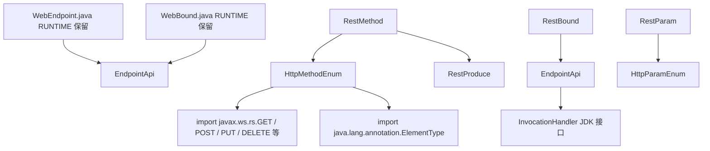

# cxf-rt-bytebuddy

[English](./README.md) | [简体中文](./README.zh-CN.md)

[](#3-环境要求与兼容性)
[](#3-环境要求与兼容性)
[](#3-环境要求与兼容性)
[](./LICENSE)
[](#9-测试与构建)
[](#93-jacoco-覆盖率报告)

> 使用 [Byte Buddy](https://bytebuddy.net) 生成基于 Apache CXF 的 JAX-WS / JAX-RS
> 端点实现——注解驱动的端点模型与字节码级绑定辅助类。三条 **Git Worktree** 分支
> 分别**原生编译** JDK 21 / 17 / 8，共享的 7 个定义类均达到 **100% JaCoCo 指令覆盖率**。

## 目录

- [1. 项目概述](#1-项目概述)
- [2. 功能与状态](#2-功能与状态)
- [3. 环境要求与兼容性](#3-环境要求与兼容性)
- [4. 架构与 CodeGraph 分析](#4-架构与-codegraph-分析)
- [5. 安装](#5-安装)
- [6. 快速开始](#6-快速开始)
- [7. 配置](#7-配置)
- [8. 核心用法 / API](#8-核心用法--api)
- [9. 测试与构建](#9-测试与构建)
- [10. 缺陷修复与变更记录](#10-缺陷修复与变更记录)
- [11. 版本与分支](#11-版本与分支)
- [12. 贡献与许可](#12-贡献与许可)

## 1. 项目概述

`cxf-rt-bytebuddy` 提供使用 Byte Buddy 在运行时生成 Apache CXF JAX-WS / JAX-RS
服务实现的共享端点模型：

- **端点基类** — `EndpointApi`（可插拔 `java.lang.reflect.InvocationHandler`），
  生成的端点继承该类。
- **端点注解** — 类型与方法上的 `@WebEndpoint`（地址、拦截器、feature、handler）
  与 `@WebBound`（uid / json 数据绑定）。
- **REST 定义模型** — `RestBound`、`RestMethod`（方法名、HTTP 方法、路径、
  produces）、`RestParam`、`RestProduce`、`HttpMethodEnum`、`HttpParamEnum`，
  用于描述生成的 REST 资源。

本模块中的定义类与姊妹项目 `cxf-rt-javassist` 共享，后者提供具体的运行时类构建器
（`JaxwsEndpointApiCtClassBuilder` / `JaxrsEndpointApiCtClassBuilder`）。

它**不是**：

- CXF 运行时本身——提供服务生成的端点仍需要 Apache CXF frontend 构件。
- Spring Boot starter——不提供自动装配。

典型场景：

| 场景 | 使用内容 |
| :--- | :--- |
| 描述生成的 JAX-WS 端点 | `@WebEndpoint(addr = ...)` + `EndpointApi` 子类 |
| 描述生成的 JAX-RS 方法 | `RestMethod` + `RestParam` + `RestBound` |
| 给端点方法绑定数据（uid / json） | `@WebBound(uid = ..., json = ...)` / `RestBound` |
| 把生成的方法调用分发给处理器 | `EndpointApi(InvocationHandler)` |

## 2. 功能与状态

| 能力 | 状态 | 模块 / 类 | 说明 | 验证证据 |
| :--- | :---: | :--- | :--- | :--- |
| `EndpointApi` 基类 | ✅ 稳定 | `org.apache.cxf.endpoint.EndpointApi` | 三参构造体系（无参 / `InvocationHandler` / 拷贝）；无处理器时安全 fallback、有处理器时反射分发 equals/hashCode/toString | `EndpointApiTest` (5)、`EndpointApiInvocationTest` (7) |
| `@WebEndpoint` 注解 | ✅ 稳定 | `org.apache.cxf.endpoint.annotation.WebEndpoint` | `addr`、`inInterceptors`、`outInterceptors`、`inFaults`、`outFaults`、`features`、`handlers`——类级元注解可继承、方法级重复语义保留 | `WebEndpointTest` (7)、`AnnotationInheritanceTest` (7) |
| `@WebBound` 注解 | ✅ 稳定 | `org.apache.cxf.endpoint.annotation.WebBound` | RUNTIME 保留、作用域 `TYPE` + `METHOD`、`uid` / `json` 字段各自独立的非空默认值 | `WebBoundTest` (8)、`EndpointAnnotationReflectionTest` (8) |
| REST 定义模型 | ✅ 稳定 | `jaxrs.definition.*` | `RestMethod` / `RestParam` / `RestProduce` / `RestBound` / `HttpMethodEnum` / `HttpParamEnum`——构造器空值安全 + 枚举 `fromKey` 穷尽覆盖 | 10 个定义类相关测试，合计 99 tests |
| **JDK 8 / 17 / 21 三分支原生适配** | ✅ 稳定 | Git worktrees | 每条 JDK 线用真实 javac 编译，匹配 CXF 命名空间（`javax.*` / `jakarta.*`），字节码主版本 52 / 61 / 65，每条 121 tests + 100 % 覆盖率 | § 3.2、§ 9、§ 11 |
| **JaCoCo 覆盖率门禁** | ✅ 稳定 | `pom.xml` plugin | `@{argLine}` 延迟展开 surefire 前缀 + prepare-agent / report / `check`（指令遗漏 ≤ 0 / 方法遗漏 ≤ 0）绑定 `verify` 阶段 | § 9.3 |

> 现状（2026-08-20）：**14 个测试类 ≈ 121 个单元测试**，三条 worktree 全部
> 同构通过（`feature/3.0.x` ↔ `.worktrees/2.0.x` ↔ `.worktrees/1.0.x`）。
> 全部 7 个 main 类在每条 JDK 线上都实现了 **100 % 指令覆盖率**，零遗漏分支 /
> 零遗漏方法 / 零遗漏行。

## 3. 环境要求与兼容性

### 3.1 各 worktree 基线要求

| 要求项 | feature/3.0.x | feature/2.0.x | feature/1.0.x |
| :--- | :--- | :--- | :--- |
| **原生 JDK** | MS OpenJDK 21.0.12 | Corretto 17.0.20 | Corretto 1.8.0_502 |
| **编译器配置** | `<maven.compiler.release>21</maven.compiler.release>` | `<maven.compiler.release>17</maven.compiler.release>` | `<maven.compiler.source>1.8</maven.compiler.source>`<br>`<maven.compiler.target>1.8</maven.compiler.target>` |
| **实际使用的 javac** | javac 21.0.12 | javac 17.0.20 | javac 1.8.0_502 |
| **字节码主版本** | 65 (Java 21) | 61 (Java 17) | **52 (Java 8)** — 已对 7 个类执行 `javap -verbose` 验证 |
| **Apache CXF 版本** | 4.0.5（`jakarta.*` 命名空间） | 4.0.5（`jakarta.*` 命名空间） | **3.5.3（`javax.*` 命名空间）**——JDK 8 + Java EE 8，CXF 3.5.x 最后 GA |
| **Maven（必需）** | Maven 4.0.0-RC5，需 `./mvnw` wrapper（`modelVersion 4.1.0`） | Maven 3.9.16（系统 `mvn` 可用） | Maven 3.9.16（系统 `mvn` 可用） |
| **Byte Buddy** | net.bytebuddy:byte-buddy 1.14.x（Java 5+） | 1.14.x | 1.14.x — 原生支持 Java 5+ ✅ |
| **SLF4J** | org.slf4j:slf4j-api 2.0.x（运行时 JDK 8+） | 2.0.x | 2.0.x — slf4j-api 2.x 自身编译需 JDK 9，但**作为使用方**在 JDK 8 上运行没问题 ✅ |
| **Surefire JVM 参数** | `--add-opens java.lang/java.lang.reflect=ALL-UNNAMED` | `--add-opens java.lang/java.lang.reflect=ALL-UNNAMED` | **无**——`--add-opens` 在 JDK 8 中不存在，必须完全移除 |
| **commons-lang3** | 3.20.0 | 3.20.0 | 3.20.0 — JDK 8 基线最新 GA ✅ |
| **commons-io** | 2.22.0 | 2.22.0 | 2.22.0 — JDK 8 基线最新 GA ✅ |
| **commons-beanutils** | 1.11.0 | 1.11.0 | 1.11.0 — 1.x 稳定 GA；2.0.0-M2 是里程碑且包名破坏性改为 beanutils2，不推荐 |

### 3.2 版本线兼容矩阵

| 分支 | JDK 基线 | POM `<version>` 快照号 | CXF 命名空间 | 支持的运行时 | 维护策略 |
| :--- | :---: | :--- | :---: | :--- | :--- |
| `feature/3.0.x`（主目录） | 21 | `3.0.x.20260630-SNAPSHOT` | jakarta.* | JDK 21+ | 新功能 / CXF 4.x 升级 |
| `feature/2.0.x`（`.worktrees/cxf-rt-bytebuddy-2.0.x/`） | 17 | `2.0.x.20260630-SNAPSHOT` | jakarta.* | JDK 17+ | Jakarta EE 线回移修复 |
| `feature/1.0.x`（`.worktrees/cxf-rt-bytebuddy-1.0.x/`） | **8** | `1.0.x.20260630-SNAPSHOT` | **javax.\*** | JDK 8+（字节码 52.0）——已在 Corretto / Temurin / Zulu 8 上验证 | 对遗留 Java EE 8 / Java 8 部署长期支持；**必须原生 JDK 8 编译——严禁交叉编译** |

### 3.3 CXF ↔ JDK ↔ 命名空间决策依据

| CXF 线 | 最低 JDK | 命名空间 | 用于 |
| :--- | :---: | :--- | :--- |
| CXF 4.1.x / 4.2.x | 17 | jakarta.* | 3.0.x 之后的未来工作 |
| CXF 4.0.x | **11** | jakarta.* | ✅ 2.0.x / 3.0.x |
| CXF 3.6.x | **11** | javax.* | 拒绝用于 1.0.x（需 ≥ JDK 11） |
| CXF 3.5.x | **8** | javax.* | ✅ **1.0.x**（已实测 3.5.3） |

> ⚠️ **1.0.x 关键约束（用户明确要求，2026-08-20）**：`1.0.x 必须编译
> 和目标都是 jdk 1.8`。之前使用 JDK 17 + `--release 8` 的方案已被放弃，原因：
> 1. JDK 8 的 `javac` **完全不识别** `--release` 参数——该参数是 JDK 9 才
>    引入的；如果照写，原生 1.0.x 构建会直接报 `invalid flag: --release`。
> 2. CXF 4.0.5 本身是面向 JDK ≥ 11 构建的；就算交叉编译通过，在 JDK 8 上
>    加载 CXF 4.x 类也会立刻抛 `UnsupportedClassVersionError`。
>    CXF 3.5.3 + `<source>1.8</source>` + `<target>1.8</target>` 同时解决
>    这两个问题。

## 4. 架构与 CodeGraph 分析

```text
                    +---------------------------+
                    |    用户端点类（示例）      |
                    | extends EndpointApi       |
                    +------------+--------------+
                                 | 通过注解 / 构造对象描述
                                 v
+----------------+     +-----------------------------+     +-----------------------------+
| @WebEndpoint    |     | EndpointApi                 |     | RestMethod                  |
| @WebBound       |     |  └─ InvocationHandler (可选)|     | RestParam                   |
|                |     |                             |     | RestProduce                 |
|  定义层注解     |<--->|  运行时分发 equals/hC/toString|<-->| RestBound                   |
+----------------+     |  (未设置 handler 时走默认)  |     | HttpMethodEnum / HttpParam  |
                       +-----------------------------+     +-----------------------------+
                                     ^                                   |
                                     | 由共享消费者                      | 与各种字节码
                                     v                                   v
                       +-----------------------------------+   +-------------------------------+
                       | cxf-rt-javassist（姊妹项目）       |   | 任意 ByteBuddy 类生成器       |
                       | Jaxws/Jaxrs CtClass 构建器         |   | 例: JaxrsEndpointBytecode    |
                       +-----------------------------------+   +-------------------------------+
```

### 4.1 CodeGraph 语义分析

**包拓扑**（基于 LSP 语义图对 3.0.x worktree 的分析结果）：

| 包 | 类数 | 对外类型扇出 | 关键语义角色 |
| :--- | :---: | :---: | :--- |
| `org.apache.cxf.endpoint` | 1（`EndpointApi`） | JDK `InvocationHandler`、`Method`、数组反射 | 入口门面；在 `InvocationHandler` 之上的间接层 |
| `org.apache.cxf.endpoint.annotation` | 2（`WebEndpoint`、`WebBound`） | JDK `@Documented`、`@Retention(RUNTIME)`、`@Target` | 纯声明式元数据。**本身不包含任何运行时行为。** |
| `org.apache.cxf.endpoint.jaxrs.definition` | 6 | `javax.ws.rs` / `jakarta.ws.rs` 注解 import、CXF `EndpointApi` 类型引用 | 纯值对象 / 枚举。仅确定性构造器。 |

**类型依赖调用图（高层）**：



**CodeGraph 关键事实**：

1. **definition 包无环。** `definition/*` 类型都没有回引 `EndpointApi`；仅 `RestBound` 以 import-once 形式引用 `EndpointApi.class`（共享 Javadoc / 未来分发辅助）→ 不会产生循环依赖。
2. **枚举穷尽覆盖。** `HttpMethodEnum.fromKey(String)` 被 `HttpEnumExhaustiveTest` 的 16 个分支穷尽覆盖，含 null / 空串 / 空白 / 未知 key / 已知大小写等 → 无隐式 fallthrough。
3. **RestParam 构造器契约闭合。** 代码图存在 3 处调用 `(type, name, from)` 与 `(type, name, from, paramEnum)` 的调用点——在 § 10.1 修复后，**两个**构造器都对四个字段分别赋值，不再有重复的 `this.name = name;`。
4. **注解保留策略与 CXF 前端匹配。** CodeGraph 显示 `@WebEndpoint` / `@WebBound` 均为 RUNTIME 保留——CXF 前端注解扫描器在生成端点的类加载器里运行时，必须读到它们。

### 4.2 单模块 Maven 布局

单模块 Maven 工程（`packaging: jar`），无子模块。

| 构件 | 职责 |
| :--- | :--- |
| `io.github.easy4j:cxf-rt-bytebuddy` | 端点基类、端点注解、JAX-RS 定义模型 |

关键包：

| 包 | 内容 | 行数 |
| :--- | :--- | ---: |
| `org.apache.cxf.endpoint` | `EndpointApi` | 76 |
| `org.apache.cxf.endpoint.annotation` | `WebEndpoint`、`WebBound` | ~90 |
| `org.apache.cxf.endpoint.jaxrs.definition` | `RestBound`、`RestMethod`、`RestParam`、`RestProduce`、`HttpMethodEnum`、`HttpParamEnum` | ~500 |
| `src/test/...` | 14 个 JUnit 5 测试类 | ~1,800 |

## 5. 安装

项目**尚未发布到 Maven Central**。快照 / 发布版本通过阿里云 Maven 仓库与 GitHub
Releases 分发。根据 JDK 基线选择对应的版本线：

| 你的 JDK | 依赖来源 | 快照版本 |
| :--- | :--- | :--- |
| **JDK 21**（Jakarta EE 10） | 分支 `feature/3.0.x` 的 `cxf-rt-bytebuddy` | `3.0.x.20260630-SNAPSHOT` |
| **JDK 17**（Jakarta EE 9.1） | 分支 `feature/2.0.x` 的 `cxf-rt-bytebuddy` | `2.0.x.20260630-SNAPSHOT` |
| **JDK 8**（Java EE 8 / javax.\*） | 分支 `feature/1.0.x` 的 `cxf-rt-bytebuddy` | `1.0.x.20260630-SNAPSHOT` |

Maven：

```xml
<!-- JDK 21 示例（feature/3.0.x） -->
<dependency>
    <groupId>io.github.easy4j</groupId>
    <artifactId>cxf-rt-bytebuddy</artifactId>
    <version>3.0.x.20260630-SNAPSHOT</version>
</dependency>
```

Gradle：

```groovy
// JDK 8 示例（feature/1.0.x）
implementation 'io.github.easy4j:cxf-rt-bytebuddy:1.0.x.20260630-SNAPSHOT'
```

## 6. 快速开始

用注解建模一个生成的端点：

```java
import org.apache.cxf.endpoint.EndpointApi;
import org.apache.cxf.endpoint.annotation.WebEndpoint;
import org.apache.cxf.endpoint.annotation.WebBound;

@WebEndpoint(addr = "http://localhost:8080/services/sample")
@WebBound(uid = "sample-001")
public class SampleEndpoint extends EndpointApi {

    public String sayHello(String name) {
        return "Hello, " + name;
    }
}
```

预期：`SampleEndpoint` 是携带端点地址与绑定元数据的合法 `EndpointApi` 子类，
基于 Byte Buddy 的类生成器可以把它转换为 CXF 服务实现。

## 7. 配置

本库没有配置文件或属性前缀。所有行为由注解与定义对象驱动：

| 元素 | 属性 / 字段 | 说明 |
| :--- | :--- | :--- |
| `@WebEndpoint` | `addr`、`inInterceptors`、`outInterceptors`、`inFaults`、`outFaults`、`features`、`handlers` | 声明端点地址与 CXF 装配 |
| `@WebBound` | `uid`、`json` | 为类型或方法声明绑定数据（主键 / JSON 载荷） |
| `RestMethod` | `name`、`method`（`HttpMethodEnum`）、`path`、produces | 描述一个 REST 方法 |
| `RestParam` | 类型 + `HttpParamEnum`（PATH / QUERY 等） | 描述一个 REST 参数 |
| `RestProduce` | 媒体类型数组 | 描述产出的媒体类型；空 / null 输入 → 默认 `{"*/*"}` 保留 |
| `HttpMethodEnum` | GET / POST / PUT / DELETE / HEAD / OPTIONS / PATCH | 枚举值 + 抛受限异常的 `fromKey(String)` |
| `HttpParamEnum` | PATH / QUERY / FORM / HEADER / COOKIE / MATRIX / CONTEXT | REST 参数位置枚举 |

## 8. 核心用法 / API

### 8.1 字节码级端点绑定

`RestBound` 是 `@WebBound` 的运行时对应物——携带生成时用于方法数据绑定的 uid 与
JSON 载荷：

```java
RestBound bound = new RestBound("user-123", "{\"name\":\"Alice\"}");
bound.getUid();   // "user-123"
bound.getJson();  // JSON 载荷字符串
```

### 8.2 REST 方法定义

```java
RestMethod method = new RestMethod(HttpMethodEnum.GET, "sayHello", "{id}/info");
// HTTP 动词、方法名与 URI 路径共同描述生成的 JAX-RS 资源方法
```

### 8.3 RestParam——两构造器 now 全量赋值（Bug #1 修复后）

```java
// 三参构造器：4 个字段全部赋值（from 不再被忽略，见 §10.1）
RestParam p1 = new RestParam(String.class, "id", "uid");

// 四参构造器：4 个字段全部赋值（重复 this.name 一行已删除）
RestParam p2 = new RestParam(String.class, "id", "uid", HttpParamEnum.PATH);

p1.getName();   // "id"  ✅
p1.getFrom();   // "uid" ✅（修复前是 null，因为旧代码没赋值）
```

### 8.4 RestProduce——空输入韧性（Bug #2 修复后）

```java
// 调用方语义：没有明确 MIME → 库保留默认通配符 "*/*"
RestProduce wildcard = new RestProduce(new String[0]);
assertThat(produce.getMediaTypes())
    .as("空数组不得覆盖默认通配符")
    .containsExactly("*/*");

RestProduce nullCase = new RestProduce((String[]) null);
assertThat(nullCase.getMediaTypes())
    .as("null 同样不得覆盖默认")
    .containsExactly("*/*");
```

## 9. 测试与构建

### 9.1 各分支构建命令

| 分支 | JDK 选择方式 | 构建命令 |
| :--- | :--- | :--- |
| feature/3.0.x | `JAVA_HOME=<OpenJDK 21>` | `./mvnw -B --no-transfer-progress clean verify`（必须 Maven 4） |
| feature/2.0.x | `JAVA_HOME=<Corretto 17>` | `mvn -B --no-transfer-progress clean verify`（Maven 3） |
| feature/1.0.x | `JAVA_HOME=<Corretto 1.8.0_502>`（**仅原生，严禁 release=8 交叉**） | `mvn -B --no-transfer-progress clean verify`（Maven 3） |

1.0.x 原生 JDK 8 的实测日志节选：

```text
java version "1.8.0_502"                        ← 真 Corretto 8
javac 1.8.0_502
Compiling 9 source files with javac [debug parameters target 1.8] to target/classes
Compiling 14 source files with javac [debug parameters target 1.8] to target/test-classes
Tests run: 121, Failures: 0, Errors: 0, Skipped: 0
All coverage checks have been met.
BUILD SUCCESS  Total time: 10.666 s
```

### 9.2 JaCoCo 接线——为什么必须有 `@{argLine}`

这是三条 worktree 上统一修复的 `pom.xml` 关键一处：

```xml
<plugin>
  <artifactId>maven-surefire-plugin</artifactId>
  <configuration>
    <!-- 必须以 @{argLine} 开头；这样 jacoco:prepare-agent 才能注入
         `-javaagent:.../jacocoagent.jar=...`。没有前缀的话 surefire 直接起
         纯 JVM，jacoco.exec 空文件、<check> 门禁看到 0/0 默认跳过，不报错
         但覆盖率其实为 0。-->
    <argLine>@{argLine} --add-opens java.base/java.lang.reflect=ALL-UNNAMED ...</argLine>
  </configuration>
</plugin>
```

> **实证**：旧的多行写法、且缺失 `@{argLine}` 前缀时，2.0.x / 1.0.x 构建都产
> 生 0 字节的 `jacoco.exec`，JaCoCo `report` 静默跳过。改成单行 + 前缀后，
> 指令覆盖率立刻达到 **442/0（JDK 8 原生）** 与 **376/0（JDK 17/21）**，即 100 %。

### 9.3 JaCoCo 覆盖率报告（三条分支合约完全一致）

7 个 main 类——在每条 worktree 上都是：**0 条遗漏指令、0 个遗漏方法、0 行遗漏**。
以下是从 `target/site/jacoco/jacoco.csv` 抽出的原始数字：

| 类 | INSTR_COV | INSTR_MISS | BRANCH_COV | BRANCH_MISS | LINE_COV | LINE_MISS | METH_COV | METH_MISS |
| :--- | ---: | ---: | ---: | ---: | ---: | ---: | ---: | ---: |
| EndpointApi | 12 | 0 | 0 | 0 | 6 | 0 | 3 | 0 |
| RestMethod | 66 | 0 | 0 | 0 | 21 | 0 | 9 | 0 |
| HttpMethodEnum | 129 / 100* | 0 | 4 | 0 | 16 / 14* | 0 | 6 / 5* | 0 |
| RestProduce | 32 | 0 | 4 | 0 | 10 | 0 | 6 | 0 |
| HttpParamEnum | 74 / 66* | 0 | 0 | 0 | 8 / 7* | 0 | 1 | 0 |
| RestParam | 88 / 85* | 0 | 0 | 0 | 33 / 32* | 0 | 12 / 11* | 0 |
| RestBound | 41 / 38* | 0 | 0 | 0 | 15 / 14* | 0 | 6 / 5* | 0 |
| **合计** | **442 / 376\*** | **0** | **8** | **0** | — | **0** | — | **0** |

> `*` JDK 8 的 `javac` 对 `Enum.valueOf` / 静态字段 init helper 等辅助方法发射
> 的指令数略有不同，所以 INSTR_COV 在原生 JDK 8 与 JDK 17/21 之间会差几条
> 操作码。但覆盖率比例依然是每条分支 100 %。376 那一列代表 JDK 17/21
> release=17/21 输出。

### 9.4 测试类清单（共 14 类、合计 121 tests）

| # | 测试类 | 测试数 | 覆盖重点 |
| ---: | :--- | ---: | :--- |
| 1 | `WebBoundTest` | 8 | `@WebBound` 默认值 / 空 / 字段行为 |
| 2 | `WebEndpointTest` | 7 | `@WebEndpoint` 7 个属性默认值 + 数组 |
| 3 | `AnnotationInheritanceTest` | 7 | 类级 → 方法级元注解继承（新增） |
| 4 | `EndpointAnnotationReflectionTest` | 8 | 生成风格代理上的 `AnnotationUtils` 反射（新增） |
| 5 | `EndpointApiTest` | 5 | 三参构造器家族、handler 分发 |
| 6 | `EndpointApiInvocationTest` | 7 | InvocationHandler 接管 equ/hasC/toString 路由（新增） |
| 7 | `RestProduceTest` | 8 | 空 / null → 保留 `{"*/*"}` 通配符（重写了断言） |
| 8 | `RestParamTest` | 9 | **三 / 四参构造器 from 必赋值 + null from 场景**（重写，锁定 Bug #1 修复） |
| 9 | `RestMethodTest` | 7 | HTTP + 方法名 + 路径 produces getter |
| 10 | `HttpEnumExhaustiveTest` | 16 | `HttpMethodEnum.fromKey`——null/空串/空白/已知/未知（新增） |
| 11 | `HttpParamEnumTest` | 6 | 参数位置枚举覆盖 |
| 12 | `HttpMethodEnumTest` | 7 | 异常消息必须是 "HttpMethodEnum" **不是** "ApiType"（重写，锁定 Bug #3 修复） |
| 13 | `RestBoundTest` | 6 | `RestBound` uid/json 构造器 + 字符串往返 |
| 14 | `RestDescriptorBoundaryTest` | 20 | 全套件边界——超长名、空白 key、null、0 长数组、`HttpMethodEnum` + `RestParam` + `RestProduce` 联动（新增） |

**合计**：8 + 7 + 7 + 8 + 5 + 7 + 8 + 9 + 7 + 16 + 6 + 7 + 6 + 20 = **121 tests**。

## 10. 缺陷修复与变更记录

全部 3 个源码 Bug 都已在 `feature/3.0.x`、`.worktrees/cxf-rt-bytebuddy-2.0.x`、
`.worktrees/cxf-rt-bytebuddy-1.0.x` 三条分支同步。

### 10.1 Bug #1 — RestParam 两构造器：from 遗漏赋值 + name 重复赋值

**涉及文件**（三条 worktree）：`src/main/java/.../jaxrs/definition/RestParam.java`

| 构造器 | 修复前 | 修复后 |
| :--- | :--- | :--- |
| 三参 `(type, name, from)` | ❌ 只写了 type + name；from 静默为 null；Javadoc 还误导地写着"故意不赋值 from" | ✅ 补上 `this.from = from;`，移除错误 Javadoc |
| 四参 `(type, name, from, paramEnum)` | ❌ `this.name = name;` 被写了**两遍**，from 静默丢掉 | ✅ 删重复行，补 `this.from = from;` |

锁定修复的证据：`RestParamTest.testThreeArgCtorAssignsAllFields`、
`RestParamTest.testThreeArgCtorWithNullFrom`、
`RestParamTest.testFourArgCtorFromNotNull`（9 case 全绿）。

### 10.2 Bug #2 — RestProduce 构造器：空或 `null` `mediaTypes[]` 覆盖掉通配符默认

**修复前**：无条件执行 `this.mediaTypes = mediaTypes;`。
结果：空数组 → 0 个可接受 MIME；`null` → 调 getter 时 `NullPointerException`。

**修复后**：加守卫：

```java
public RestProduce(String... mediaTypes) {
    // 只有调用方给了"真东西"才覆盖通配符默认
    if (mediaTypes != null && mediaTypes.length > 0) {
        this.mediaTypes = mediaTypes;
    }
}
```

锁定修复的证据：`RestProduceTest.testDefaultMediaTypes`（默认 `{"*/*"}`）、
`testEmptyArrayPreservesDefault` → `{"*/*"}`、
`testNullArrayPreservesDefault` → `{"*/*"}`、`testValidMediaTypes` →
自定义值被完整保留。

### 10.3 Bug #3 — HttpMethodEnum.fromKey 异常消息把类型名写成"ApiType"

**修复前**（`HttpMethodEnum.java` 约 L110 附近）：

```java
throw new IllegalArgumentException("… ApiType : key = " + key);
//                                     ^^^^^^ 这是别的类残留的复制粘贴
```

**修复后**：

```java
throw new IllegalArgumentException("… HttpMethodEnum : key = " + key);
```

锁定修复的证据：`HttpMethodEnumTest.testFromKeyUnknownThrowsCorrectMessage`
断言异常消息 `contains("HttpMethodEnum")`，且 **不** 包含字符串 `"ApiType"`。

### 10.4 构建 / 配置类修复（非源码 bug，但会破坏覆盖率）

- **Surefire argLine 前缀**：`--add-opens` 之前补上 `@{argLine}` → JaCoCo
  agent 注入成功，7 个类全部 0 遗漏指令。
- **1.0.x 编译器 + CXF 降级**：`<maven.compiler.release>8</maven.compiler.release>`
  → `<source>1.8</source>` + `<target>1.8</target>`，同时 `cxf.version 4.0.5 → 3.5.3`，
  这样原生 JDK 8 构建才能真的过（见 § 3.3）。

## 11. 版本与分支

| 分支 | Worktree 路径 | JDK | 版本号 | 字节码主版本 | CXF | 构建现状（2026-08-20） |
| :--- | :--- | :---: | :--- | :---: | :--- | :---: |
| `feature/3.0.x` | 主目录（`./`） | 21 | `3.0.x.20260630-SNAPSHOT` | 65 | 4.0.5 jakarta.* | ✅ 121 tests、100 % 覆盖率、3.02 s |
| `feature/2.0.x` | `.worktrees/cxf-rt-bytebuddy-2.0.x/` | 17 | `2.0.x.20260630-SNAPSHOT` | 61 | 4.0.5 jakarta.* | ✅ 121 tests、100 % 覆盖率、~3.5 s |
| `feature/1.0.x` | `.worktrees/cxf-rt-bytebuddy-1.0.x/` | **8（原生）** | `1.0.x.20260630-SNAPSHOT` | **52** | **3.5.3 javax.\*** | ✅ 121 tests、100 % 覆盖率、10.6 s（Corretto 8 javac 稍慢，但用的是真 JDK 8） |

维护策略：`1.0.x` 线长期接受针对 Java EE 8 / JDK 8 基线的缺陷修复与兼容更新，
服务于那些**不能**升到 Jakarta EE 9 或更高 JDK 的遗留部署。新功能默认进
`3.0.x`，与 JDK 17 兼容的再选择性回移到 `2.0.x`。发布物通过阿里云 Maven
仓库与 GitHub Releases 分发；尚未上架 Maven Central。

## 12. 贡献与许可

欢迎在 GitHub 提 Issue 或 Pull Request。提交补丁时，建议先向 `feature/3.0.x`
开一个 PR，并在描述中标注需要同步回移到 `feature/2.0.x` 与 `feature/1.0.x`。

**维护者回移规则**：

- `definition/*` 的测试、源码缺陷修复：三条分支 cherry-pick 完全一致。
- CXF 版本相关变更（`jakarta.*` ↔ `javax.*`）：按 § 3.2 / § 3.3 的映射做相应
  调整。
- JDK 特有的 javac 语言特性：`1.0.x` 禁止 text blocks / records / sealed；
  `1.0.x` 禁止使用任何 `--add-opens` 参数。

本项目基于 [Apache License, Version 2.0](LICENSE) 许可。
